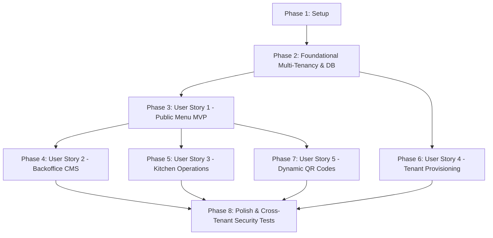

# Tasks: Multi-Tenant Digital Menu & Operations Platform (QR-Based)

**Input**: Design documents from `specs/001-multi-tenant-digital-menu/`
**Prerequisites**: `plan.md`, `spec.md`, `research.md`, `data-model.md`, `contracts/openapi.yaml`, `quickstart.md`
**Organization**: Tasks are grouped by phase and user story to enable independent, test-driven implementation.

---

## Task Format Reference

- `- [ ] [TaskID] [P?] [Story?] Description with exact file path`
- `[P]`: Denotes a task that can be executed in parallel (different files, no blocking dependencies).
- `[US1]`, `[US2]`, etc.: Denotes a user story task mapped directly to `spec.md`.

---

## Phase 1: Setup (Shared Infrastructure)

**Purpose**: Solution initialization, project dependencies, and local container infrastructure.

- [x] T001 Initialize .NET 9 solution and project structure in `src/RestoCore.Domain/`, `src/RestoCore.Application/`, `src/RestoCore.Infrastructure/`, `src/RestoCore.Api/`
- [x] T002 [P] Initialize test projects in `tests/RestoCore.UnitTests/`, `tests/RestoCore.IntegrationTests/`, `tests/RestoCore.SecurityTests/`
- [x] T003 [P] Add NuGet packages for EF Core Npgsql, OpenTelemetry, QRCoder, SkiaSharp, FluentValidation, and Testcontainers across project files
- [x] T004 Create Docker Compose configuration for local dependencies in `docker-compose.dev.yml` (PostgreSQL 16, Redis 7, OPA)
- [x] T005 [P] Create initial environment configuration template in `src/RestoCore.Api/appsettings.json` and `src/RestoCore.Api/appsettings.Development.json`

---

## Phase 2: Foundational (Blocking Prerequisites)

**Purpose**: Core multi-tenancy, database context, authorization, and telemetry infrastructure.
**Critical**: No user story implementation can begin until this foundation is complete.

- [x] T006 Create base domain entity classes and tenant scoped interface in `src/RestoCore.Domain/Common/BaseEntity.cs` and `src/RestoCore.Domain/Common/ITenantScopedEntity.cs`
- [x] T007 Implement ambient tenant context accessor in `src/RestoCore.Application/Common/Interfaces/ITenantContext.cs` and `src/RestoCore.Infrastructure/MultiTenancy/TenantContext.cs`
- [x] T008 Implement cascading tenant resolution middleware in `src/RestoCore.Infrastructure/MultiTenancy/TenantResolutionMiddleware.cs`
- [x] T009 Create Entity Framework Core database context with multi-tenant Global Query Filters in `src/RestoCore.Infrastructure/Persistence/ApplicationDbContext.cs`
- [x] T010 Implement declarative Open Policy Agent client and handler in `src/RestoCore.Infrastructure/Authorization/OpaAuthorizationHandler.cs` and `src/RestoCore.Infrastructure/Authorization/OpaClient.cs`
- [x] T011 [P] Configure OpenTelemetry tracing, metrics, and tenant baggage enrichment in `src/RestoCore.Infrastructure/Telemetry/OpenTelemetryExtensions.cs`
- [x] T012 [P] Implement global structured exception handler middleware in `src/RestoCore.Api/Middlewares/GlobalExceptionHandler.cs`
- [x] T013 Configure ASP.NET Core middleware pipeline and service container in `src/RestoCore.Api/Program.cs`

---

## Phase 3: User Story 1 - Public QR Menu Access & Navigation (Priority: P1) MVP

**Goal**: Deliver the primary commercial value: anonymous diners scan a QR or navigate to the restaurant URL to view the digital menu under 150ms with branding and availability.
**Independent Test**: Send HTTP `GET /api/v1/tenants/la-trattoria/menu` and verify that the response returns 200 OK with complete branding, categories, active dishes, and `ETag` cache headers.

### Tests for User Story 1
- [ ] T014 [P] [US1] Write contract test for public menu retrieval in `tests/RestoCore.IntegrationTests/Endpoints/PublicMenuContractTests.cs`
- [ ] T015 [P] [US1] Write integration test verifying ETag cache validation (304 Not Modified) in `tests/RestoCore.IntegrationTests/Endpoints/PublicMenuCacheTests.cs`

### Implementation for User Story 1
- [x] T016 [P] [US1] Implement Tenant entity and BrandingConfig value object in `src/RestoCore.Domain/Entities/Tenant.cs` and `src/RestoCore.Domain/ValueObjects/BrandingConfig.cs`
- [x] T017 [P] [US1] Implement Category entity in `src/RestoCore.Domain/Entities/Category.cs`
- [x] T018 [P] [US1] Implement MenuItem, ModifierGroup, and ModifierOption entities in `src/RestoCore.Domain/Entities/MenuItem.cs`, `src/RestoCore.Domain/Entities/ModifierGroup.cs`, and `src/RestoCore.Domain/Entities/ModifierOption.cs`
- [x] T019 [US1] Configure EF Core entity mappings, JSONB columns, and GIN indexes in `src/RestoCore.Infrastructure/Persistence/Configurations/TenantConfiguration.cs` and `src/RestoCore.Infrastructure/Persistence/Configurations/MenuConfiguration.cs`
- [x] T020 [US1] Create and apply initial database migration in `src/RestoCore.Infrastructure/Persistence/Migrations/`
- [x] T021 [US1] Implement public menu query handler and DTOs in `src/RestoCore.Application/Features/PublicMenu/Queries/GetPublicMenuQuery.cs` and `src/RestoCore.Application/Features/PublicMenu/DTOs/PublicMenuResponse.cs`
- [x] T022 [US1] Implement public menu minimal API endpoint with ETag and Cache-Control headers in `src/RestoCore.Api/Endpoints/PublicMenuEndpoints.cs`

---

## Phase 4: User Story 2 - Backoffice Menu Catalog Management (Priority: P1)

**Goal**: Enable restaurant administrators (`TenantAdmin`, `Manager`) to manage categories, dishes, modifiers, prices, and allergens with strict tenant isolation.
**Independent Test**: Authenticate as `TenantAdmin`, create a category and dish via API, and verify that the new items appear in the tenant catalog and cannot be accessed by other tenants.

### Tests for User Story 2
- [x] T023 [P] [US2] Write unit tests for category and menu item domain validation rules in `tests/RestoCore.UnitTests/Domain/MenuValidationTests.cs`
- [ ] T024 [P] [US2] Write integration tests for CMS category and item CRUD operations in `tests/RestoCore.IntegrationTests/Endpoints/AdminCatalogEndpointsTests.cs`

### Implementation for User Story 2
- [x] T025 [P] [US2] Implement category commands and validators in `src/RestoCore.Application/Features/Categories/Commands/CreateCategoryCommand.cs` and `src/RestoCore.Application/Features/Categories/Validators/CreateCategoryValidator.cs`
- [x] T026 [P] [US2] Implement menu item commands and validators in `src/RestoCore.Application/Features/MenuItems/Commands/CreateMenuItemCommand.cs` and `src/RestoCore.Application/Features/MenuItems/Validators/CreateMenuItemValidator.cs`
- [x] T027 [US2] Implement modifier group management commands in `src/RestoCore.Application/Features/MenuItems/Commands/ManageModifiersCommand.cs`
- [x] T028 [US2] Implement backoffice branding management command in `src/RestoCore.Application/Features/Tenants/Commands/UpdateBrandingCommand.cs`
- [x] T029 [US2] Implement backoffice administration endpoints in `src/RestoCore.Api/Endpoints/AdminCatalogEndpoints.cs` with OPA policy protection

---

## Phase 5: User Story 3 - Kitchen & Operations Real-Time Stock Control (Priority: P2)

**Goal**: Provide kitchen staff (`KitchenStaff`) with a simplified, restricted operational endpoint to toggle dish and modifier availability in real time without access to pricing or administration.
**Independent Test**: Authenticate as `KitchenStaff`, issue `PATCH /api/v1/kitchen/items/{id}/availability`, verify status is updated, and confirm that attempts to edit prices return 403 Forbidden.

### Tests for User Story 3
- [x] T030 [P] [US3] Write unit test for availability state transitions in `tests/RestoCore.UnitTests/Domain/ItemAvailabilityStateTests.cs`
- [ ] T031 [P] [US3] Write integration test verifying KitchenStaff permission boundaries in `tests/RestoCore.IntegrationTests/Endpoints/KitchenEndpointsTests.cs`

### Implementation for User Story 3
- [x] T032 [US3] Implement item availability toggle command and handler in `src/RestoCore.Application/Features/Kitchen/Commands/ToggleItemAvailabilityCommand.cs`
- [x] T033 [US3] Implement kitchen operational endpoint in `src/RestoCore.Api/Endpoints/KitchenEndpoints.cs` protected by OPA `KitchenStaff` role policy
- [ ] T034 [US3] Implement catalog cache invalidation hook upon item availability change in `src/RestoCore.Infrastructure/Caching/CatalogCacheInvalidator.cs`

---

## Phase 6: User Story 4 - Multi-Tenant Provisioning & Tenant Resolution (Priority: P2)

**Goal**: Allow platform `SuperAdmin` to onboard new restaurant tenants, allocating unique slugs, initial branding, and administrator accounts.
**Independent Test**: Send `POST /api/v1/admin/tenants` as `SuperAdmin`, verify tenant record creation, and resolve the new tenant context via route slug.

### Tests for User Story 4
- [ ] T035 [P] [US4] Write integration test for tenant provisioning and slug collision prevention in `tests/RestoCore.IntegrationTests/Endpoints/TenantProvisioningTests.cs`

### Implementation for User Story 4
- [x] T036 [US4] Implement tenant provisioning command and validator in `src/RestoCore.Application/Features/Tenants/Commands/ProvisionTenantCommand.cs` and `src/RestoCore.Application/Features/Tenants/Validators/ProvisionTenantValidator.cs`
- [x] T037 [US4] Implement tenant administration endpoints in `src/RestoCore.Api/Endpoints/AdminTenantEndpoints.cs` restricted to `SuperAdmin`
- [ ] T038 [US4] Implement custom domain and subdomain lookup caching in `src/RestoCore.Infrastructure/MultiTenancy/TenantLookupService.cs`

---

## Phase 7: User Story 5 - Dynamic Vector QR Code Generation (Priority: P3)

**Goal**: Generate vector SVG and high-resolution PNG QR codes with embedded tenant branding for tables and entrance points.
**Independent Test**: Call `GET /api/v1/admin/tables/{id}/qr?format=svg` and verify that a valid vector SVG payload encoding the table menu URL is returned.

### Tests for User Story 5
- [x] T039 [P] [US5] Write unit tests for QR code encoding and URL construction in `tests/RestoCore.UnitTests/Qr/QrCodeServiceTests.cs`
- [ ] T040 [P] [US5] Write integration tests for QR code generation endpoint in `tests/RestoCore.IntegrationTests/Endpoints/QrCodeEndpointsTests.cs`

### Implementation for User Story 5
- [x] T041 [P] [US5] Implement Table domain entity in `src/RestoCore.Domain/Entities/Table.cs`
- [x] T042 [US5] Configure EF Core Table entity configuration and migration in `src/RestoCore.Infrastructure/Persistence/Configurations/TableConfiguration.cs`
- [x] T043 [US5] Implement vector SVG and raster PNG QR generation service using QRCoder and SkiaSharp in `src/RestoCore.Infrastructure/Qr/QrCodeService.cs`
- [x] T044 [US5] Implement table QR query and endpoint in `src/RestoCore.Application/Features/QrCodes/Queries/GetTableQrQuery.cs` and `src/RestoCore.Api/Endpoints/AdminTableEndpoints.cs`

---

## Phase 8: Polish & Cross-Cutting Concerns

**Purpose**: Security validation, distributed tracing verification, and production readiness gates.

- [ ] T045 Implement automated cross-tenant security test suite using Testcontainers in `tests/RestoCore.SecurityTests/MultiTenancy/CrossTenantIsolationTests.cs`
- [ ] T046 [P] Verify OpenTelemetry spans export with mandatory `tenant.id` enrichment in `tests/RestoCore.IntegrationTests/Telemetry/OpenTelemetryEnrichmentTests.cs`
- [x] T047 [P] Configure healthcheck endpoints (`/healthz`, `/ready`) checking PostgreSQL, Redis, and OPA connectivity in `src/RestoCore.Api/Endpoints/HealthEndpoints.cs`
- [ ] T048 Update developer documentation and execute full test suite verification in `README.md` and `specs/001-multi-tenant-digital-menu/quickstart.md`

---

## Dependencies & Story Execution Order

---

## Parallel Execution Opportunities

- **Setup Phase**: T002, T003, and T005 can run simultaneously once T001 is complete.
- **Foundational Phase**: T011 and T012 can run in parallel while T009 and T010 are in progress.
- **User Story 1**: T014 and T015 (tests) and T016, T017, T018 (domain models) can all be written concurrently in parallel.
- **User Story 2 & User Story 3**: Once User Story 1 is functional, Phase 4 (Backoffice CMS) and Phase 5 (Kitchen Operations) can be implemented independently by separate developers.
- **User Story 5**: QR generation logic (T043) is completely decoupled from catalog CRUD.

---

## Implementation Strategy

1. **MVP Increment (Phases 1, 2, and 3)**:
   - Sets up the multi-tenant engine and delivers the public menu read endpoint (`GET /api/v1/tenants/{slug}/menu`) with sub-150ms performance and caching.
2. **Operations Increment (Phases 4 and 5)**:
   - Adds full backoffice catalog management and kitchen real-time availability toggling.
3. **Enterprise & Provisioning Increment (Phases 6 and 7)**:
   - Adds multi-tenant onboarding, custom domain mapping, and dynamic vector QR code exports.
4. **Security & Governance Gate (Phase 8)**:
   - Certifies 100% cross-tenant isolation and OpenTelemetry distributed trace compliance.
