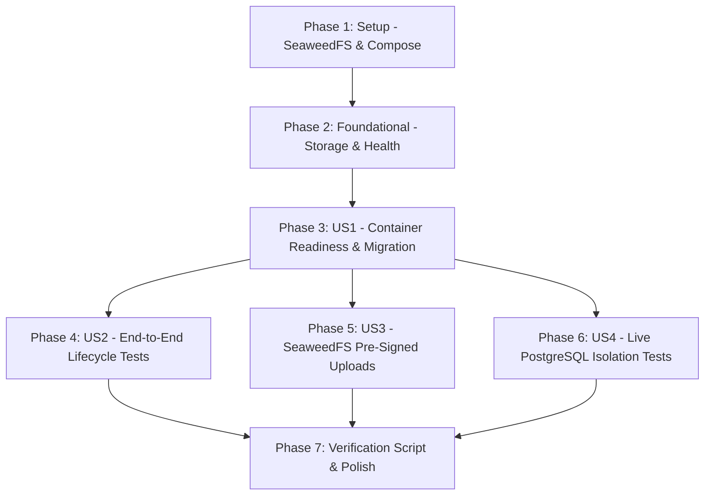

# Tasks: Controlled Containerized Test Environment & End-to-End Verification

**Input**: Design documents from `specs/002-docker-dev-testing/`
**Prerequisites**: `plan.md`, `spec.md`, `research.md`, `data-model.md`, `contracts/storage-api.yaml`

---

## Phase 1: Setup (Shared Container & Storage Infrastructure)

**Purpose**: Configure SeaweedFS and container dependencies in `docker-compose.dev.yml` and install S3 storage tooling.

- [x] T001 Update `docker-compose.dev.yml` to include `seaweedfs` service (Master, Volume, Filer, and S3 gateway on ports 8333, 8888, 9333) with automated health checks and persistent volume
- [x] T002 Add S3 bucket auto-initialization service (`create-bucket`) in `docker-compose.dev.yml` to create `restocore-images` bucket on startup
- [x] T003 [P] Add `AWSSDK.S3` NuGet package to `src/RestoCore.Infrastructure/RestoCore.Infrastructure.csproj`
- [x] T004 [P] Configure storage and container endpoints in `src/RestoCore.Api/appsettings.Development.json` (SeaweedFS S3 endpoint `http://localhost:8333`, region `us-east-1`, bucket `restocore-images`)

---

## Phase 2: Foundational (Storage Abstraction & Multi-Service Health)

**Purpose**: Core storage pre-signing interfaces and deep health verification required across all user stories.

- [x] T005 [P] Implement `IStorageService` interface in `src/RestoCore.Application/Common/Interfaces/IStorageService.cs` defining `GeneratePresignedUploadUrl`
- [x] T006 Implement `SeaweedStorageService` in `src/RestoCore.Infrastructure/Storage/SeaweedStorageService.cs` using `AWSSDK.S3` with path-style addressing and 15-minute expiration
- [x] T007 Register `IStorageService` in `src/RestoCore.Api/Program.cs`
- [x] T008 Update `src/RestoCore.Api/Endpoints/HealthEndpoints.cs` to verify PostgreSQL, Redis, SeaweedFS, and OPA connectivity on `GET /ready`

---

## Phase 3: User Story 1 - Orchestrated Infrastructure Readiness & Connectivity (Priority: P1) ?? MVP

**Goal**: Validate that all four services (PostgreSQL, Redis, SeaweedFS, OPA) initialize, reach healthy status, and accept connections in under 45 seconds.
**Independent Test**: Launch `docker compose -f docker-compose.dev.yml up -d`, query port status, and send HTTP GET `/ready`, verifying that all services respond with healthy status.

### Implementation & Verification for User Story 1
- [x] T009 [US1] Spin up container environment using `docker compose -f docker-compose.dev.yml up -d`
- [x] T010 [US1] Write infrastructure connectivity smoke test in `tests/RestoCore.IntegrationTests/Infrastructure/ContainerReadinessTests.cs` verifying PostgreSQL, Redis, SeaweedFS S3, and OPA endpoints
- [x] T011 [US1] Execute database schema migration against the live containerized PostgreSQL database using `dotnet ef database update`

---

## Phase 4: User Story 2 - End-to-End Multi-Tenant Lifecycle Verification (Priority: P1)

**Goal**: Execute comprehensive automated integration tests against the live containerized stack verifying the entire restaurant operations flow (Tenant onboarding -> Backoffice catalog creation -> Kitchen real-time availability toggle -> Table QR code generation -> Public menu retrieval with ETag/304).
**Independent Test**: Execute `FullLifecycleE2ETests.cs` against the live containerized stack and assert HTTP status codes and database state mutations.

### Tests & Verification for User Story 2
- [x] T012 [P] [US2] Create integration test fixture `ContainerizedStackFixture.cs` in `tests/RestoCore.IntegrationTests/Fixtures/ContainerizedStackFixture.cs` configuring WebApplicationFactory against container endpoints
- [x] T013 [US2] Implement end-to-end lifecycle test in `tests/RestoCore.IntegrationTests/Endpoints/FullLifecycleE2ETests.cs` testing tenant registration, category/item creation, kitchen availability toggle, table QR code query, and public menu retrieval with ETag validation

---

## Phase 5: User Story 3 - SeaweedFS Decoupled Storage & Pre-Signed Upload Validation (Priority: P2)

**Goal**: Allow administrators to request pre-signed S3 upload URLs and upload images directly to SeaweedFS (ADR-0004), ensuring zero binary transfers through the backend API.
**Independent Test**: Send `POST /api/v1/admin/images/presigned-url`, upload a sample image directly to SeaweedFS via HTTP PUT, and verify public accessibility via HTTP GET.

### Implementation & Verification for User Story 3
- [x] T014 [P] [US3] Implement image pre-signing command and endpoint in `src/RestoCore.Application/Features/Storage/Commands/GeneratePresignedUploadCommand.cs` and `src/RestoCore.Api/Endpoints/StorageEndpoints.cs`
- [x] T015 [US3] Map storage endpoints in `src/RestoCore.Api/Program.cs` under `/api/v1/admin/images`
- [x] T016 [US3] Write integration test in `tests/RestoCore.IntegrationTests/Storage/SeaweedStorageTests.cs` requesting pre-signed URL, performing direct binary PUT to SeaweedFS, and verifying public image retrieval

---

## Phase 6: User Story 4 - Strict Multi-Tenant Isolation & Boundary Enforcement (Priority: P2)

**Goal**: Prove 100% data boundary isolation in the real PostgreSQL database engine by asserting that queries and mutations filtered by Tenant A cannot leak or alter Tenant B data.
**Independent Test**: Execute `CrossTenantDatabaseIsolationTests.cs` against live PostgreSQL, asserting zero cross-tenant row access.

### Tests & Verification for User Story 4
- [x] T017 [US4] Implement automated cross-tenant security and isolation test in `tests/RestoCore.SecurityTests/MultiTenancy/CrossTenantDatabaseIsolationTests.cs` asserting query isolation and rejection of unauthorized cross-tenant mutations in PostgreSQL

---

## Phase 7: Polish & Automated Verification Gate

**Purpose**: Consolidate test scripts, verify full build, and document operational verification.

- [x] T018 Create automated PowerShell verification script `scripts/verify-docker-env.ps1` that spins up containers, applies migrations, runs all integration and security test suites, and outputs a structured report
- [x] T019 Update `README.md` and `specs/002-docker-dev-testing/quickstart.md` with verified Docker environment instructions and results
- [x] T020 Run full test suite (`dotnet test RestoCore.slnx`) ensuring 100% test pass rate across all projects

---

## Dependencies & Story Execution Order

