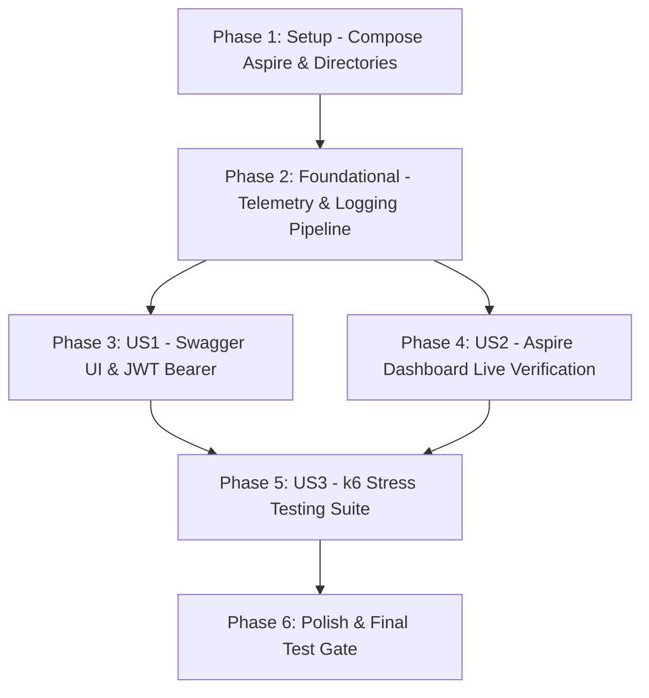

# Tasks: Stress Testing (k6), Distributed Telemetry (Aspire Dashboard), and Development API Documentation (Swagger UI)

**Input**: Design documents from `specs/003-k6-aspire-swagger/`
**Prerequisites**: `plan.md`, `spec.md`, `research.md`, `data-model.md`, `contracts/observability-api.yaml`

---

## Phase 1: Setup (Docker Observability & Dependencies)

**Purpose**: Configure container infrastructure for Aspire Dashboard in `docker-compose.dev.yml` and prepare stress testing scripts.

- [x] T001 Add `aspire-dashboard` service (`mcr.microsoft.com/dotnet/aspire-dashboard:latest`) to `docker-compose.dev.yml` exposing ports 18888 (Web UI), 4317 (OTLP gRPC), and 4318 (OTLP HTTP) with anonymous development access
- [x] T002 [P] Create stress testing scripts directory structure at `scripts/k6/`

---

## Phase 2: Foundational (Telemetry Configuration & Logging Infrastructure)

**Purpose**: Core OpenTelemetry OTLP pipeline updates required across all endpoints and user stories.

- [x] T003 Update `OpenTelemetry:OtlpEndpoint` in `src/RestoCore.Api/appsettings.Development.json` pointing to `http://localhost:4317`
- [x] T004 [P] Update `src/RestoCore.Infrastructure/Telemetry/OpenTelemetryExtensions.cs` to add structured logging exporter with OTLP export (`AddOtlpExporter`) and HTTP client instrumentation (`AddHttpClientInstrumentation`)
- [x] T005 [P] Implement `ActivityEnrichingMiddleware` (or enricher in `OpenTelemetryExtensions.cs`) to tag all spans with `tenant.id` and `tenant.slug` from `ITenantContext`

---

## Phase 3: User Story 1 - Interactive API Exploration & Frontend Development Integration (Priority: P1) ?? MVP

**Goal**: Provide interactive Swagger UI with JWT Bearer authentication support exclusively in `Development` environment so frontend developers can explore endpoints and test requests.
**Independent Test**: Start API in Development mode, browse to `http://localhost:5000/swagger`, verify OpenAPI spec loads with endpoint groups, and execute an authenticated request with a Bearer token.

### Implementation & Verification for User Story 1
- [x] T006 [P] [US1] Configure `AddSwaggerGen` in `src/RestoCore.Api/Program.cs` to include API metadata, OpenAPI 3.0/3.1 document definition, and `AddSecurityDefinition` / `AddSecurityRequirement` for JWT Bearer token authentication
- [x] T007 [US1] Configure Swagger and Swagger UI middleware in `src/RestoCore.Api/Program.cs` conditionally guarded by `app.Environment.IsDevelopment()`
- [x] T008 [US1] Write integration test in `tests/RestoCore.IntegrationTests/Endpoints/SwaggerEndpointTests.cs` asserting `GET /swagger/v1/swagger.json` returns 200 OK and OpenAPI JSON document in Development environment, and returns 404 in Production

---

## Phase 4: User Story 2 - Real-Time Distributed Telemetry via .NET Aspire Dashboard (Priority: P1)

**Goal**: Spin up Aspire Dashboard and verify that traces with `tenant.id`, database query spans, and structured logs appear in real time when requests hit the API.
**Independent Test**: Boot `docker compose -f docker-compose.dev.yml up -d`, open `http://localhost:18888`, send a sample API request (`GET /api/v1/public/menus/{tenantSlug}`), and assert trace and log entries are visible in the dashboard.

### Implementation & Verification for User Story 2
- [x] T009 [US2] Launch updated Docker Compose environment (`docker compose -f docker-compose.dev.yml up -d`) and verify `restocore-aspire-dashboard-dev` is running and accessible on port 18888
- [x] T010 [US2] Write integration test in `tests/RestoCore.IntegrationTests/Infrastructure/AspireDashboardReadinessTests.cs` verifying Aspire Dashboard HTTP UI (port 18888) and OTLP gRPC endpoint (port 4317) reachability
- [x] T011 [US2] Trigger API requests through `FullLifecycleE2ETests` or HTTP client to verify that spans contain `tenant.id` attribute and correlate with logs

---

## Phase 5: User Story 3 - Load & Stress Testing with k6 (Priority: P2)

**Goal**: Write and execute automated k6 load and stress tests against the live API stack asserting that public digital menu reads meet the strict latency budget (< 500ms dynamic, < 150ms p95 with ETag 304) under concurrent load.
**Independent Test**: Execute `scripts/run-stress-tests.ps1` against running containers and API, asserting 100% threshold passes for cached and dynamic requests.

### Implementation & Verification for User Story 3
- [x] T012 [P] [US3] Create baseline load test script in `scripts/k6/public-menu-load.js` simulating 20 concurrent virtual users querying `GET /api/v1/public/menus/{tenantSlug}`
- [x] T013 [P] [US3] Create ETag caching stress test script in `scripts/k6/etag-cache-test.js` validating `If-None-Match` header returns `304 Not Modified` with `p(95) < 150ms` under 50 virtual users
- [x] T014 [P] [US3] Create ramp-up stress test script in `scripts/k6/public-menu-stress.js` ramping up to 100 virtual users verifying `http_req_duration: p(95) < 500ms` and `http_req_failed: rate < 0.01`
- [x] T015 [US3] Create automated PowerShell runner script `scripts/run-stress-tests.ps1` supporting both native `k6` CLI and `grafana/k6:latest` Docker fallback

---

## Phase 6: Polish & Verification Gate

**Purpose**: Execute full test suite, verify clean build, update documentation, and confirm zero regressions.

- [x] T016 Execute k6 stress test runner (`scripts/run-stress-tests.ps1`) against the local API and capture latency output
- [x] T017 Run full test suite across the solution (`dotnet test RestoCore.slnx`) ensuring 100% pass rate across unit, integration, and security tests
- [x] T018 Update `README.md` and `specs/003-k6-aspire-swagger/quickstart.md` with instructions for accessing Aspire Dashboard, running Swagger UI, and executing k6 stress tests

---

## Dependencies & Story Execution Order

