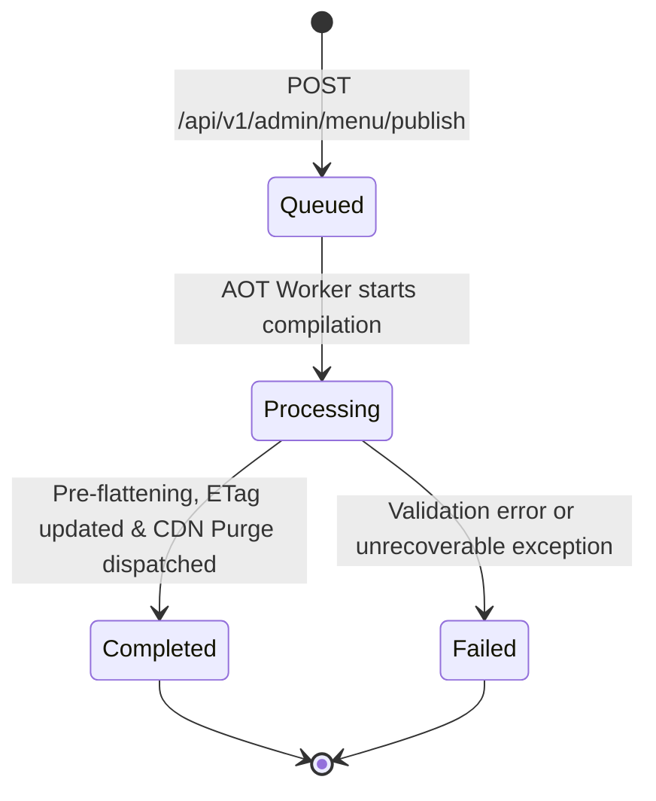

# Data Model: Canvas Menu Layout & AOT Perimeter Compilation

**Feature**: `005-canvas-layout-aot-compilation`
**Status**: Approved
**Date**: 2026-09-17

---

## 1. Domain Entities & Value Objects

### 1.1. `LayoutConfig` (Value Object / Owned Entity)
Semi-structured presentation metadata describing the free-form canvas layout for a restaurant's digital menu.

| Property | Type | Nullable | Validation Rules | Description |
| :--- | :--- | :---: | :--- | :--- |
| `CanvasEnabled` | `bool` | No | Required | Toggles free-form canvas layout vs default sequential categories. |
| `BackgroundUrl` | `string` | Yes | Valid URI format if provided | Public URL of background image hosted in SeaweedFS. |
| `BackgroundColor` | `string` | Yes | Hex color (`#RRGGBB` or `#RGB`) | Fallback background CSS color. |
| `Elements` | `List<CanvasElement>` | No | Default empty list | Collection of positioned dish elements. |

### 1.2. `CanvasElement` (Value Object / Owned Entity)
Geometrical coordinates and dimensions for a single catalog dish placed on the canvas.

| Property | Type | Nullable | Validation Rules | Description |
| :--- | :--- | :---: | :--- | :--- |
| `DishId` | `Guid` | No | Must not be `Guid.Empty` | Identifies the catalog `MenuItem` positioned on the canvas. |
| `X` | `double` | No | `>= 0.0` | Horizontal coordinate on the 2D plane (pixels or relative units). |
| `Y` | `double` | No | `>= 0.0` | Vertical coordinate on the 2D plane (pixels or relative units). |
| `ZIndex` | `int` | No | `>= 0` | Stacking order / depth layer of the element. |
| `Width` | `double` | No | `> 0.0` | Element width. |
| `Height` | `double` | No | `> 0.0` | Element height. |

### 1.3. `MenuPublishJob` (Domain Entity)
Tracks asynchronous AOT compilation runs triggered by restaurant administrators.

| Property | Type | Nullable | Validation Rules | Description |
| :--- | :--- | :---: | :--- | :--- |
| `Id` | `Guid` | No | Primary Key | Unique publication job identifier. |
| `TenantId` | `Guid` | No | Foreign Key to `tenants(id)` | Restaurant owning the menu. |
| `TenantSlug` | `string` | No | Max length 50 | Restaurant identifier used for CDN cache tags. |
| `Status` | `string` | No | In `["queued", "processing", "completed", "failed"]` | Current job lifecycle state. |
| `VersionHash` | `string` | No | Max length 64 | Deterministic hash identifying the compiled menu artifact. |
| `CdnPurgeRequested` | `bool` | No | Default `false` | Indicates whether CDN purge call was initiated. |
| `AssetsQueued` | `int` | No | `>= 0` | Number of media assets queued for optimization. |
| `EstimatedDurationSeconds`| `int` | No | Typically `3` | SLA budget for publication job. |
| `TriggeredAt` | `DateTime` | No | UTC timestamp | When publication was triggered. |
| `CompletedAt` | `DateTime` | Yes | UTC timestamp | When compilation finished. |
| `ErrorMessage` | `string` | Yes | Populated on failure | Diagnostic message if job failed. |

---

## 2. Entity Framework Core Persistence Mapping

### `TenantConfiguration` Update
`Tenant` owns `LayoutConfig`, which is mapped to a PostgreSQL `jsonb` column:

```csharp
builder.OwnsOne(t => t.LayoutConfig, layout =>
{
    layout.ToJson();
    layout.OwnsMany(l => l.Elements);
});

builder.Property(t => t.CurrentVersionHash)
    .HasMaxLength(64);
```

### `MenuPublishJobConfiguration`
```csharp
public class MenuPublishJobConfiguration : IEntityTypeConfiguration<MenuPublishJob>
{
    public void Configure(EntityTypeBuilder<MenuPublishJob> builder)
    {
        builder.ToTable("menu_publish_jobs");
        builder.HasKey(j => j.Id);
        builder.Property(j => j.TenantSlug).HasMaxLength(50).IsRequired();
        builder.Property(j => j.Status).HasMaxLength(20).IsRequired();
        builder.Property(j => j.VersionHash).HasMaxLength(64).IsRequired();
        builder.HasIndex(j => new { j.TenantId, j.TriggeredAt });
    }
}
```

---

## 3. State Machine: `MenuPublishJob`



---

## 4. Invariants and Business Rules

1. **Decoupled Mutation:** Modifying `LayoutConfig` MUST NOT alter `MenuItem.Price`, `Category.Name`, or modifier relationships.
2. **Orphan Element Resilience:** When generating public menu or AOT artifacts, any `CanvasElement` whose `DishId` does not correspond to an active, available `MenuItem` for the tenant is automatically excluded from the output.
3. **Deterministic Hash:** `VersionHash` is computed as:
   `v{DateTime.UtcNow:yyyyMMddHHmmss}-{SHA256(FlattenedLayoutJson + CatalogSnapshotJson):8}`
4. **Idempotent / Sequenced Publish:** Triggering publication while another job is processing completes with the latest state without corrupting intermediate cache artifacts.