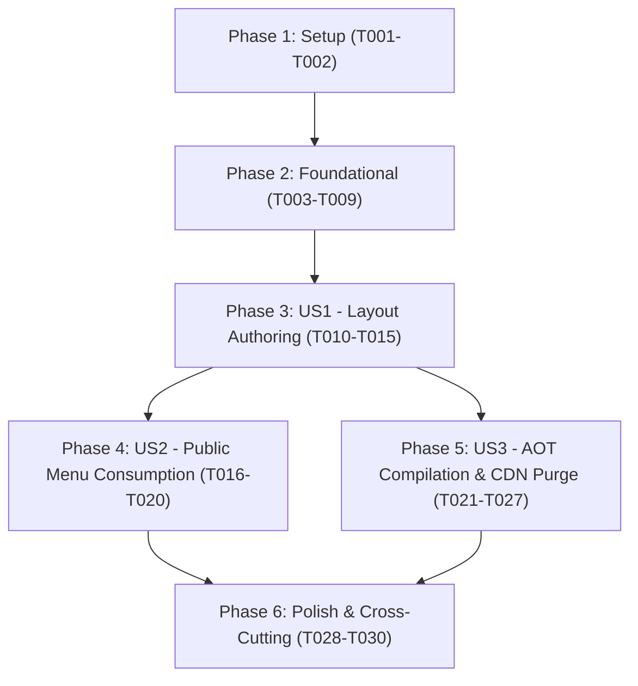

# Tasks: Canvas Menu Layout & AOT Perimeter Compilation

**Input**: Design documents from `specs/005-canvas-layout-aot-compilation/`
**Prerequisites**: `plan.md`, `spec.md`, `research.md`, `data-model.md`, `contracts/openapi-canvas.yaml`
**Organization**: Tasks are grouped by user story to enable independent implementation and testing of each slice.

---

## Format: `[ID] [P?] [Story] Description`

- **[P]**: Parallelizable (different files, no blocking dependencies on incomplete tasks)
- **[Story]**: Target user story ([US1], [US2], [US3])
- File paths are exact and project-relative

---

## Phase 1: Setup (Shared Infrastructure)

**Purpose**: Core interfaces and services for CDN purging and pipeline communication

- [x] T001 Create `ICdnPurgeService` interface in `src/RestoCore.Application/Common/Interfaces/ICdnPurgeService.cs`
- [x] T002 [P] Implement `LocalDevelopmentCdnPurgeService` in `src/RestoCore.Infrastructure/Services/Cdn/LocalDevelopmentCdnPurgeService.cs` and register in DI (`DependencyInjection.cs`)

---

## Phase 2: Foundational (Blocking Prerequisites)

**Purpose**: Domain models, EF Core JSONB mapping, and database migration required by all user stories

**⚠️ CRITICAL**: User story tasks depend on completion of this foundational phase.

- [x] T003 [P] Create `LayoutConfig` and `CanvasElement` value objects in `src/RestoCore.Domain/ValueObjects/LayoutConfig.cs` and `src/RestoCore.Domain/ValueObjects/CanvasElement.cs`
- [x] T004 [P] Create `MenuPublishJob` domain entity in `src/RestoCore.Domain/Entities/MenuPublishJob.cs`
- [x] T005 Extend `Tenant` entity with `LayoutConfig? LayoutConfig` and `string? CurrentVersionHash` in `src/RestoCore.Domain/Entities/Tenant.cs`
- [x] T006 Configure EF Core JSONB mapping for `Tenant.LayoutConfig` in `src/RestoCore.Infrastructure/Persistence/Configurations/TenantConfiguration.cs`
- [x] T007 [P] Configure EF Core mapping for `MenuPublishJob` in `src/RestoCore.Infrastructure/Persistence/Configurations/MenuPublishJobConfiguration.cs`
- [x] T008 Register `DbSet<MenuPublishJob>` in `src/RestoCore.Infrastructure/Persistence/ApplicationDbContext.cs` and create EF migration `AddCanvasLayoutAndMenuPublishJobs` in `src/RestoCore.Infrastructure/Persistence/Migrations/`
- [x] T009 Add OPA Rego authorization rules for `menu:update_layout` and `menu:publish` in `specs/policies/rbac.rego`

**Checkpoint**: Foundation ready - domain entities, persistence mappings, and security policies are in place.

---

## Phase 3: User Story 1 - Canvas Layout Authoring & Decoupling (Priority: P1) 🎯 MVP

**Goal**: Enable restaurant administrators (`owner`/`tenant_admin`) to customize 2D dish positioning and canvas background settings via `PUT /api/v1/admin/menu/layout`, persisted in PostgreSQL as semi-structured JSONB decoupled from catalog entities.

**Independent Test**: Send a `PUT /api/v1/admin/menu/layout` request with valid coordinates and assert that the updated layout configuration is persisted and returned with HTTP 200, while catalog dishes and prices remain intact.

### Tests for User Story 1 ⚠️

- [x] T010 [P] [US1] Unit test for `UpdateMenuLayoutValidator` in `tests/RestoCore.UnitTests/Features/MenuLayout/UpdateMenuLayoutValidatorTests.cs`
- [x] T011 [P] [US1] Integration test for `PUT /api/v1/admin/menu/layout` (verifying 200 OK, 400 Bad Request on invalid coordinates, and 403 Forbidden on wrong tenant) in `tests/RestoCore.IntegrationTests/Endpoints/AdminMenuLayoutEndpointsTests.cs`

### Implementation for User Story 1

- [x] T012 [P] [US1] Create DTOs `LayoutConfigDto` and `CanvasElementDto` in `src/RestoCore.Application/Features/MenuLayout/DTOs/LayoutConfigDto.cs`
- [x] T013 [P] [US1] Implement `UpdateMenuLayoutValidator` using FluentValidation in `src/RestoCore.Application/Features/MenuLayout/Validators/UpdateMenuLayoutValidator.cs`
- [x] T014 [US1] Implement `UpdateMenuLayoutCommand` and handler in `src/RestoCore.Application/Features/MenuLayout/Commands/UpdateMenuLayoutCommand.cs`
- [x] T015 [US1] Register Minimal API endpoint `PUT /api/v1/admin/menu/layout` with OPA policy verification in `src/RestoCore.Api/Endpoints/AdminMenuLayoutEndpoints.cs`

**Checkpoint**: User Story 1 is functional and testable independently. Restaurant administrators can author and persist custom visual layouts.

---

## Phase 4: User Story 2 - Public Menu Consumption with Canvas Mode & Resilient Fallback (Priority: P1)

**Goal**: Deliver the `layout_config` alongside the catalog in `GET /api/v1/tenants/{tenant_slug}/menu` with orphan dish pruning, fallback to default sequential layout when disabled, and conditional HTTP 304 Not Modified evaluation.

**Independent Test**: Query `GET /api/v1/tenants/{tenant_slug}/menu` with canvas enabled and disabled; verify that the response structure matches OpenAPI 3.1, orphaned elements are omitted, and `If-None-Match` yields HTTP 304.

### Tests for User Story 2 ⚠️

- [x] T016 [P] [US2] Unit test for orphan dish pruning and canvas delivery logic in `tests/RestoCore.UnitTests/Features/PublicMenu/PublicMenuCanvasTests.cs`
- [x] T017 [P] [US2] Integration test for `GET /api/v1/tenants/{tenant_slug}/menu` asserting `layout_config` delivery, ETag header, and HTTP 304 on matching `If-None-Match` in `tests/RestoCore.IntegrationTests/Endpoints/PublicMenuCanvasEndpointsTests.cs`

### Implementation for User Story 2

- [x] T018 [P] [US2] Extend `PublicMenuResponse` with `LayoutConfigDto? LayoutConfig` in `src/RestoCore.Application/Features/PublicMenu/DTOs/PublicMenuResponse.cs`
- [x] T019 [US2] Update `GetPublicMenuQueryHandler` in `src/RestoCore.Application/Features/PublicMenu/Queries/GetPublicMenuQuery.cs` to load `Tenant.LayoutConfig`, filter orphaned elements referencing deleted/inactive dishes, and attach ETag
- [x] T020 [US2] Update `PublicMenuEndpoints.cs` in `src/RestoCore.Api/Endpoints/PublicMenuEndpoints.cs` to handle conditional `If-None-Match` header validation and return HTTP 304 Not Modified

**Checkpoint**: User Stories 1 and 2 are functional. Public guests receive the customized visual layout with resilient fallback and fast conditional caching.

---

## Phase 5: User Story 3 - Ahead-Of-Time (AOT) Compilation Pipeline & Perimeter CDN Purging (Priority: P2)

**Goal**: Provide asynchronous publication via `POST /api/v1/admin/menu/publish`, returning HTTP 202 Accepted, executing backend geometry pre-flattening, computing deterministic `version_hash`, and issuing selective cache tag purges to the CDN.

**Independent Test**: Call `POST /api/v1/admin/menu/publish` with admin credentials; verify HTTP 202 Accepted response with `job_id`, `version_hash`, status `queued`/`processing`, and verify that the tenant's `CurrentVersionHash` is updated and CDN purge is executed.

### Tests for User Story 3 ⚠️

- [x] T021 [P] [US3] Unit test for `MenuCompilationService` (pre-flattening, orphan filtering, and deterministic SHA-256 hash generation) in `tests/RestoCore.UnitTests/Features/MenuLayout/MenuCompilationServiceTests.cs`
- [x] T022 [P] [US3] Integration test for `POST /api/v1/admin/menu/publish` (verifying 202 Accepted, `job_id`, and `version_hash`) in `tests/RestoCore.IntegrationTests/Endpoints/MenuPublishEndpointsTests.cs`

### Implementation for User Story 3

- [x] T023 [P] [US3] Create DTOs `MenuPublishRequest` and `MenuPublishJobResponse` in `src/RestoCore.Application/Features/MenuLayout/DTOs/MenuPublishDtos.cs`
- [x] T024 [P] [US3] Define `IMenuCompilationService` interface in `src/RestoCore.Application/Features/MenuLayout/Services/IMenuCompilationService.cs`
- [x] T025 [US3] Implement `MenuCompilationService` (geometry pre-flattening, orphan pruning, SHA-256 hash computation, tenant ETag update) in `src/RestoCore.Infrastructure/Services/Compilation/MenuCompilationService.cs`
- [x] T026 [US3] Implement `PublishMenuCommand` and handler in `src/RestoCore.Application/Features/MenuLayout/Commands/PublishMenuCommand.cs`
- [x] T027 [US3] Register Minimal API endpoint `POST /api/v1/admin/menu/publish` with OPA policy verification in `src/RestoCore.Api/Endpoints/AdminMenuLayoutEndpoints.cs`

**Checkpoint**: All three user stories are complete. The end-to-end authoring, public delivery, and AOT perimeter compilation workflows are functional.

---

## Phase 6: Polish & Cross-Cutting Concerns

**Purpose**: Telemetry, cache invalidation synchronization, and full test suite verification

- [x] T028 [P] Add OpenTelemetry tracing with structured attribute `error.code="CDN_PURGE_FAILURE"` on CDN purge exceptions in `src/RestoCore.Infrastructure/Services/Cdn/LocalDevelopmentCdnPurgeService.cs`
- [x] T029 Synchronize distributed Redis cache invalidation on menu layout update and publication in `src/RestoCore.Application/Features/MenuLayout/Commands/PublishMenuCommand.cs`
- [x] T030 Execute full automated test suite (`dotnet test`) ensuring 100% pass rate across unit, integration, and security tests

---

## Dependencies & Execution Order

### Parallel Opportunities Identified

- **In Setup & Foundational**:
  - `T001` and `T002` can run in parallel with `T003` and `T004`.
  - `T006` and `T007` (EF Core configurations) can run in parallel.
- **In User Story 1**:
  - `T010` (Unit test) and `T011` (Integration test) can be written in parallel.
  - `T012` (DTOs) and `T013` (Validator) can be implemented in parallel.
- **In User Story 2**:
  - `T016` (Unit test) and `T017` (Integration test) can be written in parallel.
- **In User Story 3**:
  - `T021` (Unit test) and `T022` (Integration test) can be written in parallel.
  - `T023` (DTOs) and `T024` (Service interface) can be implemented in parallel.

---

## Implementation Strategy

1. **MVP Scope (Phase 1 to Phase 3)**:
   - Foundational JSONB mapping + User Story 1 (`PUT /api/v1/admin/menu/layout`).
   - Verifies that visual geometry can be persisted cleanly and decoupled from catalog entities.
2. **Incremental Delivery (Phase 4)**:
   - User Story 2 delivers public consumption of the canvas layout with orphan pruning and conditional 304 caching.
3. **Enterprise Hardening (Phase 5 & 6)**:
   - User Story 3 introduces asynchronous AOT compilation, deterministic version hashing, CDN cache tag invalidation, and OpenTelemetry failure metrics.